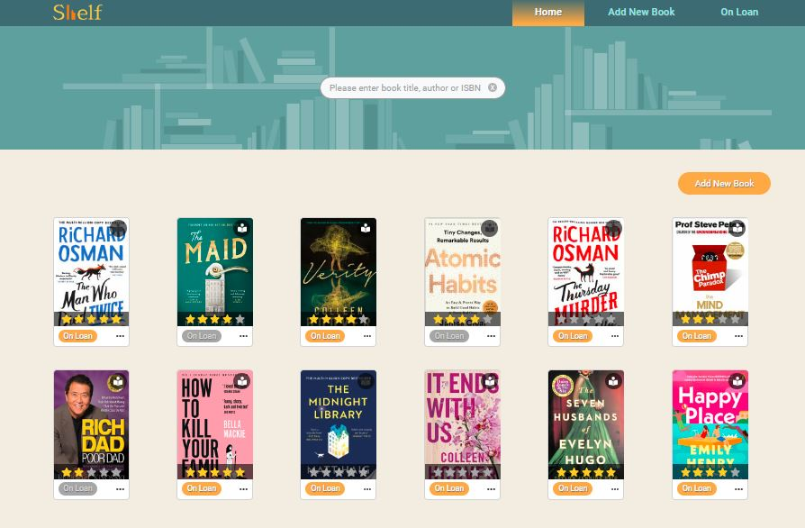
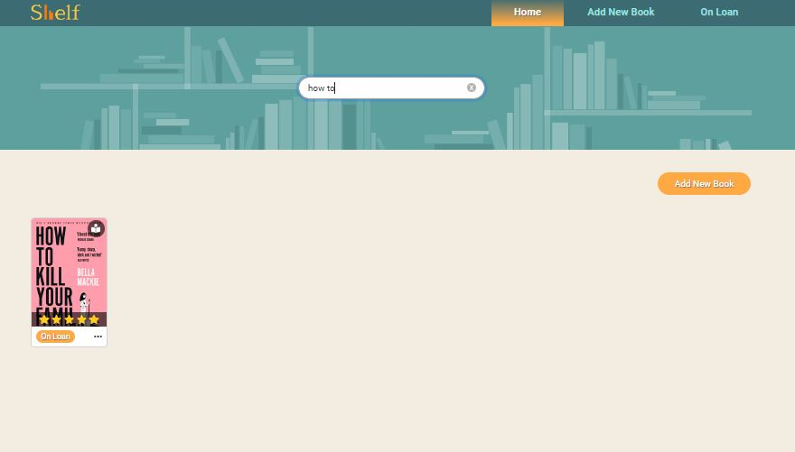
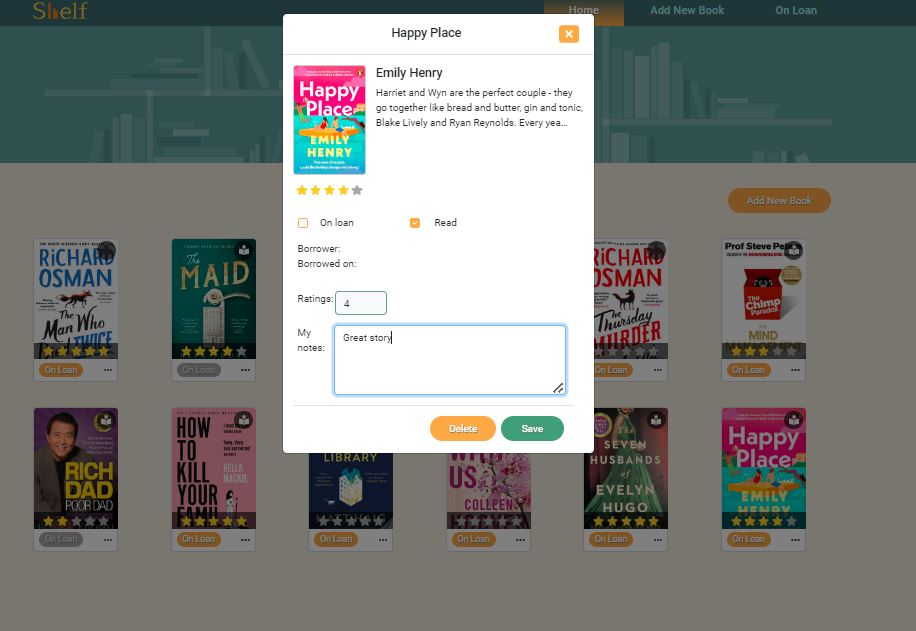
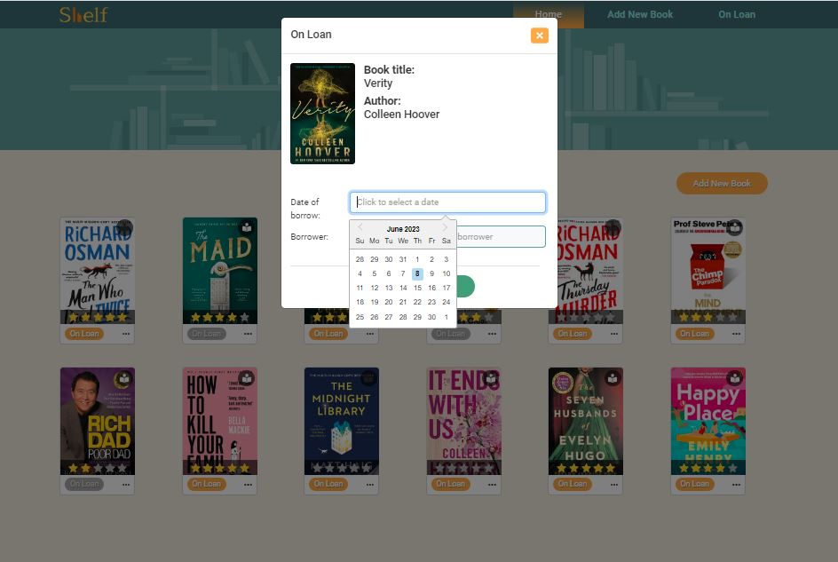
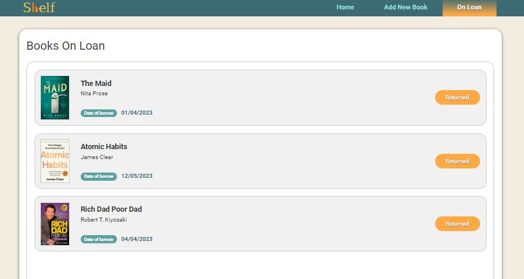
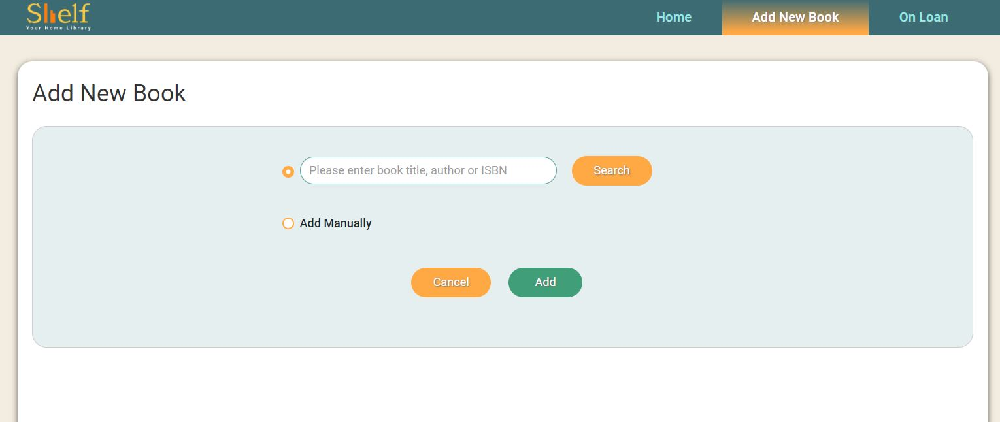
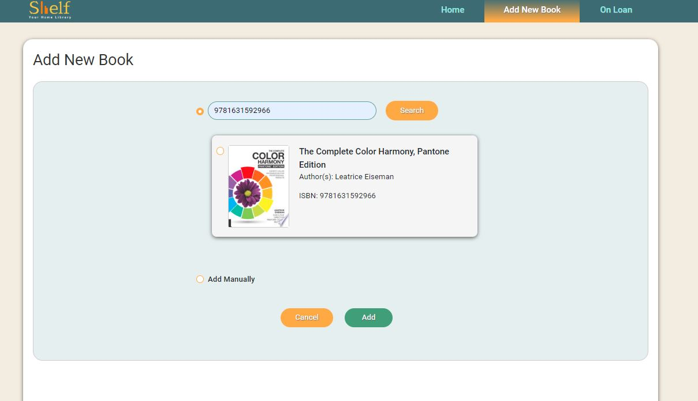
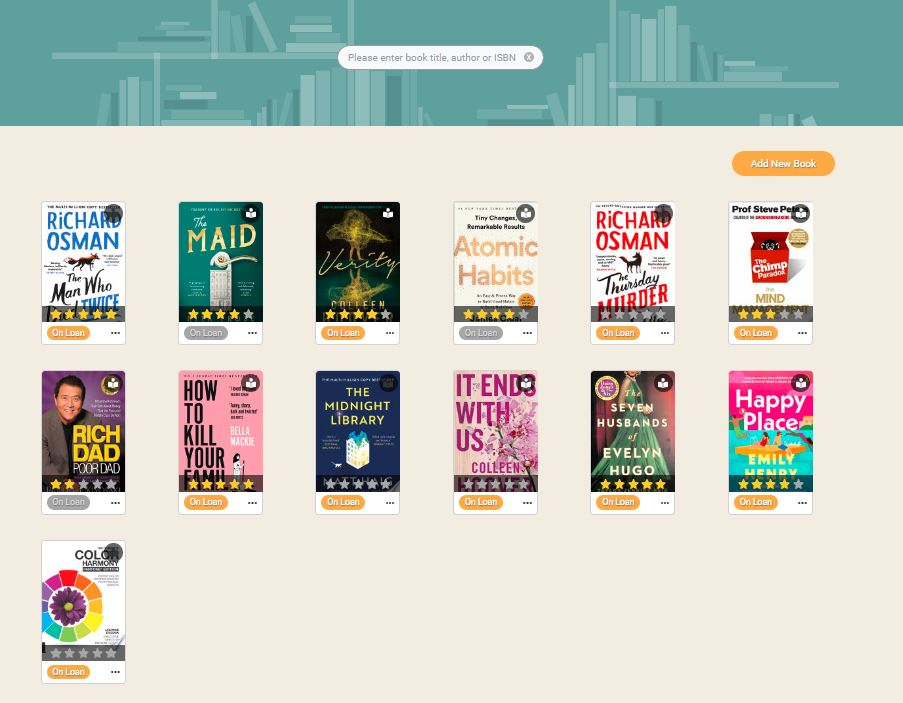
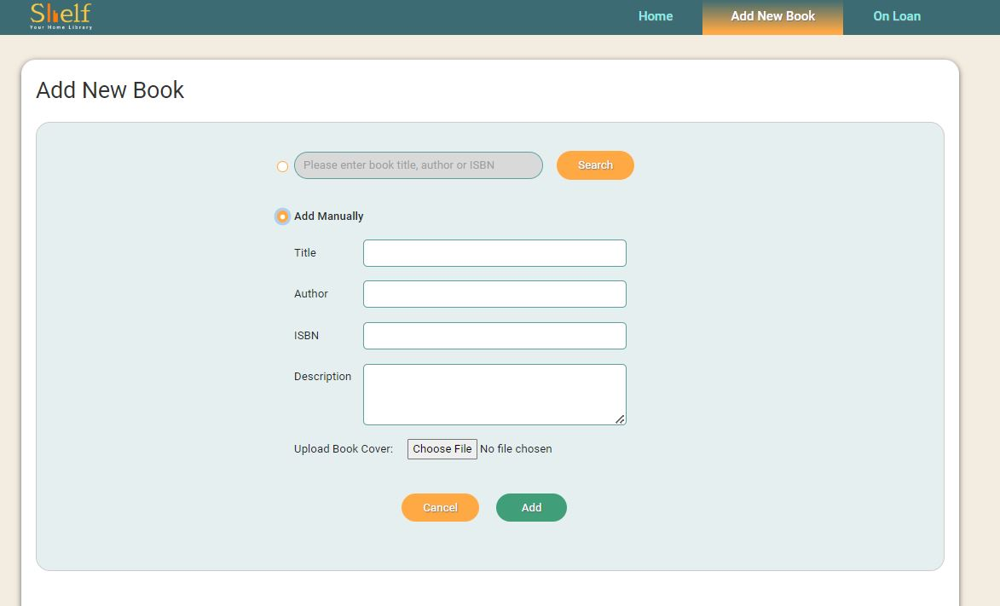

# Your Home Library App - Shelf, v1.0 Group Project 

## Description

**Shelf** is a user-friendly React-based single page application.

It serves as a record-keeping system for your personal book collection.

It is a convenient way to store all information about books you own and be able to access it from any device wherever you are.

User story:
I have a lot of books at home. I want a digital solution to organize and manage my extensive book collection:
- What books do I have at home? I want to see a catalog of my books and be able to search it by author, title, genre. When I am at the bookstore and considering buying a new book, I can quickly check my phone to see if I already own it.
- Which books I have read?
- What was the book about, my opinion about it, any other notes I want to leave for myself about the book?
- Do I have it at home, or borrowed it to a friend?
  
All information about my books in one place!

## Installation

There is no installation needed, please visit:  [Shelf](https://home-library-app.netlify.app/). 

Our App is deployed on Netlify.

## Usage

On the home page of the app, the list of existing books in the home library is displayed:

You can serch for the book by title, author or ISBN number:

You can see more details about individual book - click on the tree dots in the right bottom corner of the book card, and the modal with book details will be displayed.

If you read the book, you can check "Read" box, give the book your rating (from 1 to 5) and write your notes about the book, your opinion or anything you want to say to yourself about this book. Save results. 

I the book is marked as read, the active book icon is displayed on the book card (right top corner). By default, book icon is dimmed.

The book rating value you gave is displayed as stars (from 1 to 5).

If you would like to borrow a book to friend, click "On Loan" button on the book card on the Home screen. The modal for this book will open:

Here you can choose the date, when you give the book, write the name of the borrower and save.

On Home screen, the "On Loan" button will become inactive grey - that's how you quickly can see the book is not at home. 

You also can see the list of the books you have borrowed by clicking "On Loan" navigation link:

When your friend returned the book, click "Returned" button. The book will disappear from this list and in the Home screen "On Loan" button will become active orange again - that's how you visually see the book is at home.

If you would like to add a new book, all you need to do is click "Add New Book" button or click "Add New Book" navigation link:

To find book details from database (Google Books API), enter book title, author or ISBN number into the search field and click "Search" button:

Click the radio button next to the book (there might be multiple books displayed when searched by author or title) and click "Add" button. Now your new book details are added to your library catalog:

If the book can't be found in the database, you can add book details manually: 

Fill in the details for the book, upload book cover image, click save and the book will be added to your book catalog.

## Technologies/libraries/tools used

- React 
- Javascript
- CSS
- HTML
- Bootstrap
- Netlify
- [react-datepicker](https://www.npmjs.com/package/react-datepicker) 
- [Google Books API](https://developers.google.com/books/docs/overview)
- [react-toastify](https://www.npmjs.com/package/react-toastify)

## Future development

The app is a front-end product for now, version 1. For app to function fully, the database solution needs to be implemented, also Login feature in order to display user-specific content.

## Credits

Collaborators:

- [Adrian Wong](https://github.com/adriwg)
- [Fatma Keskin](https://github.com/milkibeka)
- [Eleasha Bains](https://github.com/ekh-b)
- [Asta Remeikiene](https://github.com/AstaRem)

## License

This project is licensed under the terms of the MIT license.

<!-- ## Tests

Go the extra mile and write tests for your application. Then provide examples on how to run them here. -->